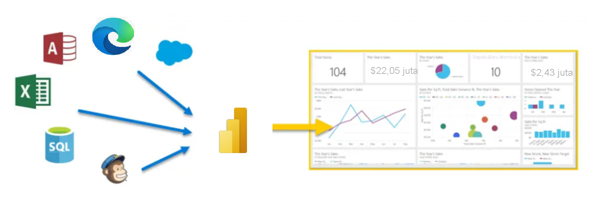

**Microsoft Power BI** adalah kumpulan layanan perangkat lunak, aplikasi, dan konektor yang berfungsi bersama untuk mengubah sumber data Anda yang tidak terkait menjadi wawasan yang koheren, imersif secara visual, serta interaktif. Baik data Anda adalah buku kerja Microsoft Excel sederhana, atau kumpulan gudang data hibrida berbasis cloud dan lokal, **Power BI** memungkinkan Anda terhubung ke sumber data, memvisualisasikan (atau menemukan) hal penting, dan membagikannya kepada siapa saja dengan mudah.

> [!VIDEO https://www.microsoft.com/videoplayer/embed/RWFLap]

**Power BI** bekerja secara sederhana dan tangkas, serta mampu membuat wawasan cepat dari buku kerja Excel atau database lokal. Namun, **Power BI** juga kuat dan dapat digunakan di tingkat perusahaan, sehingga tidak hanya siap untuk pemodelan yang luas dan analitik real-time, tetapi juga untuk pengembangan kustom. Oleh karena itu, Power BI dapat menjadi alat visualisasi dan laporan pribadi Anda, serta dapat berfungsi sebagai analitik dan mesin keputusan di balik proyek grup, divisi, atau seluruh perusahaan.

Jika Anda merupakan **pemula** dalam menggunakan Power BI, modul ini akan membantu Anda memahaminya. Jika Anda telah **berpengalaman** dalam menggunakan Power BI, modul ini akan merangkum keseluruhan konsep dan memastikan Anda telah sepenuhnya memahami seluruh informasi.

Berikut adalah laporan kerja Power BI. Jangan ragu untuk mengeklik dan menjelajahinya.

<iframe width="1140" height="540" src=https://msit.powerbi.com/view?r=eyJrIjoiNGE0MTRiNDMtZWMyZS00MzVlLTgyMmQtYzI2MjM5Nzg4OTQwIiwidCI6IjcyZjk4OGJmLTg2ZjEtNDFhZi05MWFiLTJkN2NkMDExZGI0NyIsImMiOjV9 frameborder="0" allowFullScreen="true"></iframe>

## Bagian dari Power BI
Power BI terdiri dari aplikasi desktop Microsoft Windows yang disebut **Power BI Desktop**, layanan SaaS (*Software as a Service*) online yang disebut **layanan Power BI**, dan **aplikasi** Power BI seluler yang tersedia di semua perangkat, dengan aplikasi BI seluler asli untuk Windows, iOS, dan Android.

Ketiga elemen ini—aplikasi **Desktop**, **layanan**, dan **Seluler**—dirancang untuk memungkinkan orang membuat, berbagi, dan menggunakan wawasan bisnis seefektif mungkin untuk melayani mereka atau berdasarkan peran mereka.

## Cara Power BI menyesuaikan peran Anda
Cara menggunakan Power BI dapat bergantung pada peran Anda pada proyek atau tim. Orang lain, dengan peran lain, mungkin menggunakan Power BI secara berbeda dan hal ini bukan sebuah masalah.

Misalnya, Anda mungkin menampilkan laporan serta dasbor di **layanan Power BI**, dan mungkin hanya itu yang Anda lakukan dengan Power BI. Namun, rekan kerja Anda yang membuat laporan bisnis dengan mengolah angka mungkin memanfaatkan **Power BI Desktop** secara ekstensif (dan menerbitkan laporan Power BI Desktop ke layanan Power BI, yang kemudian Anda gunakan untuk menampilkannya). Rekan kerja yang lain, di bagian penjualan, mungkin hanya menggunakan aplikasi ponsel Power BI untuk memantau kemajuan kuota penjualannya dan menelusuri detail peluang penjualan baru.

Anda juga dapat menggunakan setiap elemen **Power BI** pada waktu yang berbeda, bergantung pada apa yang ingin Anda capai dan apa peran Anda dalam proyek atau upaya tertentu.

Anda mungkin menampilkan kemajuan inventaris serta manufaktur pada dasbor real-time dalam layanan dan juga menggunakan **Power BI Desktop** guna membuat laporan untuk tim Anda sendiri tentang statistik keterlibatan pelanggan. Cara Anda menggunakan Power BI dapat bergantung pada fitur atau layanan Power BI mana yang merupakan alat terbaik untuk situasi Anda. Namun, setiap bagian dari Power BI tersedia untuk Anda, sehingga membuatnya sangat fleksibel dan menarik.

Kami membahas ketiga elemen ini—aplikasi **Desktop**, **layanan**, dan **Seluler**—secara lebih rinci nanti. Di unit dan modul yang akan datang, kami juga akan membuat laporan di Power BI Desktop, membagikannya dalam layanan, dan akhirnya menelusurinya di perangkat seluler.

## Mengunduh Power BI Desktop

Anda dapat mengunduh Power BI Desktop dari web atau sebagai aplikasi dari Microsoft Store pada tab Windows.

| Mengunduh Strategi | Tautan | Catatan |
|-------------------|------|-----------------------------------|
| Aplikasi Windows Store | <a href="https://aka.ms/pbidesktopstore" target="_blank">Bursa Windows</a>| Akan selalu diperbarui secara otomatis |
| Unduh dari web | [Download .msi](https://go.microsoft.com/fwlink/?LinkID=521662) | Harus diperbarui secara manual dan berkala |

## Masuk ke layanan Power BI
Sebelum dapat masuk ke Power BI, Anda memerlukan sebuah akun. Untuk mendapatkan uji coba gratis, buka <a href="https://go.microsoft.com/fwlink/?linkid=2101313" target="_blank">app.powerbi.com</a> dan daftar menggunakan alamat email Anda. 

Untuk langkah mendetail dalam menyiapkan akun, lihat [Masuk ke layanan Power BI](https://docs.microsoft.com/power-bi/consumer/end-user-sign-in)

## Alur kerja di Power BI
Alur kerja umum di Power BI dimulai dari **Power BI Desktop** tempat laporan dibuat. Laporan tersebut kemudian diterbitkan ke **layanan Power BI** dan akhirnya dibagikan, sehingga pengguna aplikasi **Power BI Mobile** dapat menggunakan informasi tersebut.

Alur tidak akan selalu terjadi seperti ini dan hal itu bukanlah sebuah masalah. Namun, kami akan menggunakan alur itu untuk membantu Anda mempelajari berbagai bagian Power BI dan cara bagian tersebut saling melengkapi.

Baik, sekarang kita memiliki gambaran umum dari modul ini, apa itu Power BI, serta tiga elemen utamanya, mari kita lihat bagaimana rasanya menggunakan **Power BI**.

