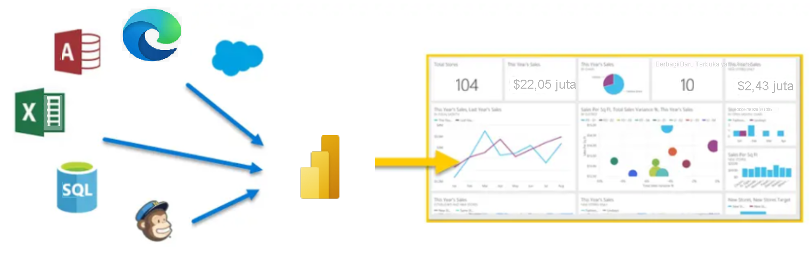
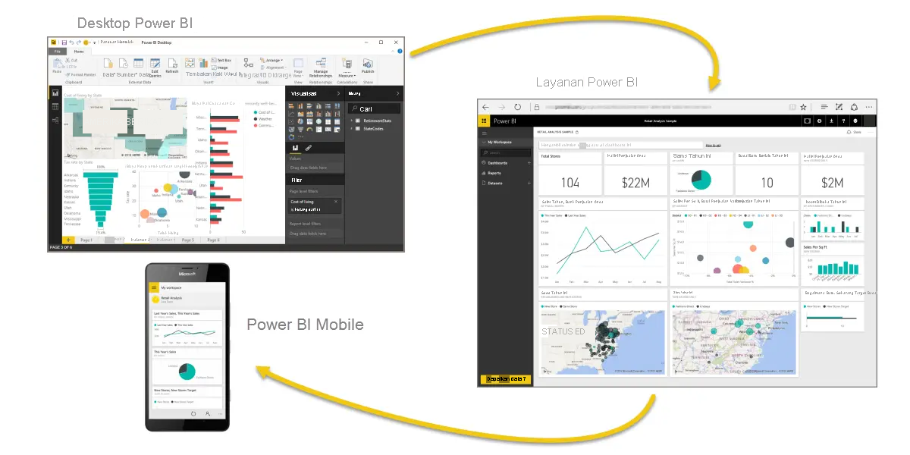

**Microsoft Power BI** adalah kumpulan layanan perangkat lunak, aplikasi, dan konektor yang berfungsi bersama untuk mengubah sumber data Anda yang tidak terkait menjadi wawasan yang koheren, imersif secara visual, serta interaktif.**Microsoft Power BI** is a collection of software services, apps, and connectors that work together to turn your unrelated sources of data into coherent, visually immersive, and interactive insights. Baik data Anda adalah buku kerja Microsoft Excel sederhana, atau kumpulan gudang data hibrida berbasis cloud dan lokal, **Power BI** memungkinkan Anda terhubung ke sumber data, memvisualisasikan (atau menemukan) hal penting, dan membagikannya kepada siapa saja dengan mudah.Whether your data is a simple Microsoft Excel workbook, or a collection of cloud-based and on-premises hybrid data warehouses, **Power BI** lets you easily connect to your data sources, visualize (or discover) what's important, and share that with anyone or everyone.

> [!VIDEO https://www.microsoft.com/videoplayer/embed/RWFLap]

**Power BI** bekerja secara sederhana dan tangkas, serta mampu membuat wawasan cepat dari buku kerja Excel atau database lokal.**Power BI** can be simple and fast, capable of creating quick insights from an Excel workbook or a local database. Namun, **Power BI** juga kuat dan dapat digunakan di tingkat perusahaan, sehingga tidak hanya siap untuk pemodelan yang luas dan analitik real-time, tetapi juga untuk pengembangan kustom.But **Power BI** is also robust and enterprise-grade, ready not only for extensive modeling and real-time analytics, but also for custom development. Oleh karena itu, Power BI dapat menjadi alat visualisasi dan laporan pribadi Anda, serta dapat berfungsi sebagai analitik dan mesin keputusan di balik proyek grup, divisi, atau seluruh perusahaan.Therefore, it can be your personal report and visualization tool, but can also serve as the analytics and decision engine behind group projects, divisions, or entire corporations.

Jika Anda merupakan **pemula** dalam menggunakan Power BI, modul ini akan membantu Anda memahaminya.If you're a **beginner** with Power BI, this module will get you going. Jika Anda telah **berpengalaman** dalam menggunakan Power BI, modul ini akan merangkum keseluruhan konsep dan memastikan Anda telah sepenuhnya memahami seluruh informasi.If you're a Power BI **veteran**, this module will tie concepts together and fill in the gaps.

Berikut adalah laporan kerja Power BI.Here is a working Power BI report. Jangan ragu untuk mengeklik dan menjelajahinya.Feel free to click and explore.

<iframe width="1140" height="540" src=https://msit.powerbi.com/view?r=eyJrIjoiNGE0MTRiNDMtZWMyZS00MzVlLTgyMmQtYzI2MjM5Nzg4OTQwIiwidCI6IjcyZjk4OGJmLTg2ZjEtNDFhZi05MWFiLTJkN2NkMDExZGI0NyIsImMiOjV9 frameborder="0" allowFullScreen="true"></iframe>

## Bagian dari Power BIThe parts of Power BI
Power BI terdiri dari aplikasi desktop Microsoft Windows yang disebut **Power BI Desktop**, layanan SaaS (*Software as a Service*) online yang disebut **layanan Power BI**, dan **aplikasi** Power BI seluler yang tersedia di semua perangkat, dengan aplikasi BI seluler asli untuk Windows, iOS, dan Android.Power BI consists of a Microsoft Windows desktop application called **Power BI Desktop**, an online SaaS (*Software as a Service*) service called the **Power BI service**, and mobile Power BI **apps** that are available on any device, with native mobile BI apps for Windows, iOS, and Android.

Ketiga elemen ini—aplikasi **Desktop**, **layanan**, dan **Seluler**—dirancang untuk memungkinkan orang membuat, berbagi, dan menggunakan wawasan bisnis seefektif mungkin untuk melayani mereka atau berdasarkan peran mereka.These three elements—**Desktop**, the **service**, and **Mobile** apps—are designed to let people create, share, and consume business insights in the way that serves them, or their role, most effectively.

## Cara Power BI menyesuaikan peran AndaHow Power BI matches your role
Cara menggunakan Power BI dapat bergantung pada peran Anda pada proyek atau tim.How you use Power BI might depend on your role on a project or a team. Orang lain, dengan peran lain, mungkin menggunakan Power BI secara berbeda dan hal ini bukan sebuah masalah.And other people, in other roles, might use Power BI differently, which is just fine.

Misalnya, Anda mungkin menampilkan laporan serta dasbor di **layanan Power BI**, dan mungkin hanya itu yang Anda lakukan dengan Power BI.For example, you might view reports and dashboards in the **Power BI service**, and that might be all you do with Power BI. Namun, rekan kerja Anda yang membuat laporan bisnis dengan mengolah angka mungkin memanfaatkan **Power BI Desktop** secara ekstensif (dan menerbitkan laporan Power BI Desktop ke layanan Power BI, yang kemudian Anda gunakan untuk menampilkannya).But your number-crunching, business-report-creating coworker might make extensive use of **Power BI Desktop** (and publish Power BI Desktop reports to the Power BI service, which you then use to view them). Rekan kerja yang lain, di bagian penjualan, mungkin hanya menggunakan aplikasi ponsel Power BI untuk memantau kemajuan kuota penjualannya dan menelusuri detail peluang penjualan baru.And another coworker, in sales, might mainly use her Power BI phone app to monitor progress on her sales quotas and drill into new sales lead details.

Anda juga dapat menggunakan setiap elemen **Power BI** pada waktu yang berbeda, bergantung pada apa yang ingin Anda capai dan apa peran Anda dalam proyek atau upaya tertentu.You also might use each element of **Power BI** at different times, depending on what you're trying to achieve, or what your role is for a given project or effort.

Anda mungkin menampilkan kemajuan inventaris serta manufaktur pada dasbor real-time dalam layanan dan juga menggunakan **Power BI Desktop** guna membuat laporan untuk tim Anda sendiri tentang statistik keterlibatan pelanggan.Perhaps you view inventory and manufacturing progress in a real-time dashboard in the service, and also use **Power BI Desktop** to create reports for your own team about customer engagement statistics. Cara Anda menggunakan Power BI dapat bergantung pada fitur atau layanan Power BI mana yang merupakan alat terbaik untuk situasi Anda.How you use Power BI can depend on which feature or service of Power BI is the best tool for your situation. Namun, setiap bagian dari Power BI tersedia untuk Anda, sehingga membuatnya sangat fleksibel dan menarik.But each part of Power BI is available to you, which is why it's so flexible and compelling.

Kami membahas ketiga elemen ini—aplikasi **Desktop**, **layanan**, dan **Seluler**—secara lebih rinci nanti.We discuss these three elements—**Desktop**, the **service**, and **Mobile** apps—in more detail later. Di unit dan modul yang akan datang, kami juga akan membuat laporan di Power BI Desktop, membagikannya dalam layanan, dan akhirnya menelusurinya di perangkat seluler.In upcoming units and modules, we'll also create reports in Power BI Desktop, share them in the service, and eventually drill into them on our mobile device.

## Mengunduh Power BI DesktopDownload Power BI Desktop

Anda dapat mengunduh Power BI Desktop dari web atau sebagai aplikasi dari Microsoft Store pada tab Windows.You can download Power BI Desktop from the web or as an app from the Microsoft Store on the Windows tab.

| Mengunduh StrategiDownload Strategy | TautanLink | CatatanNotes |
|-------------------|------|-----------------------------------|
| Aplikasi Windows StoreWindows Store App | <a href="https://aka.ms/pbidesktopstore" target="_blank">Bursa Windows</a><a href="https://aka.ms/pbidesktopstore" target="_blank">Windows Store</a>| Akan selalu diperbarui secara otomatisWill automatically stay updated |
| Unduh dari webDownload from web | [Download .msiDownload .msi](https://go.microsoft.com/fwlink/?LinkID=521662) | Harus diperbarui secara manual dan berkalaMust manually update periodically |

## Masuk ke layanan Power BISign in to Power BI service
Sebelum dapat masuk ke Power BI, Anda memerlukan sebuah akun.Before you can sign in to Power BI, you'll need an account. Untuk mendapatkan uji coba gratis, buka <a href="https://go.microsoft.com/fwlink/?linkid=2101313" target="_blank">app.powerbi.com</a> dan daftar menggunakan alamat email Anda.To get a free trial, go to <a href="https://go.microsoft.com/fwlink/?linkid=2101313" target="_blank">app.powerbi.com</a> and sign up with your email address. 

Untuk langkah mendetail dalam menyiapkan akun, lihat [Masuk ke layanan Power BI](https://docs.microsoft.com/power-bi/consumer/end-user-sign-in)For detailed steps on setting up an account, see [Sign in to Power BI service](https://docs.microsoft.com/power-bi/consumer/end-user-sign-in)

## Alur kerja di Power BIThe flow of work in Power BI
Alur kerja umum di Power BI dimulai dari **Power BI Desktop** tempat laporan dibuat.A common flow of work in Power BI begins in **Power BI Desktop**, where a report is created. Laporan tersebut kemudian diterbitkan ke **layanan Power BI** dan akhirnya dibagikan, sehingga pengguna aplikasi **Power BI Mobile** dapat menggunakan informasi tersebut.That report is then published to the **Power BI service** and finally shared, so that users of **Power BI Mobile** apps can consume the information.

Alur tidak akan selalu terjadi seperti ini dan hal itu bukanlah sebuah masalah.It doesn't always happen that way, and that's okay. Namun, kami akan menggunakan alur itu untuk membantu Anda mempelajari berbagai bagian Power BI dan cara bagian tersebut saling melengkapi.But we'll use that flow to help you learn the different parts of Power BI and how they complement each other.

Baik, sekarang kita memiliki gambaran umum dari modul ini, apa itu Power BI, serta tiga elemen utamanya, mari kita lihat bagaimana rasanya menggunakan **Power BI**.Okay, now that we have an overview of this module, what Power BI is, and its three main elements, let's take a look at what it's like to use **Power BI**.

