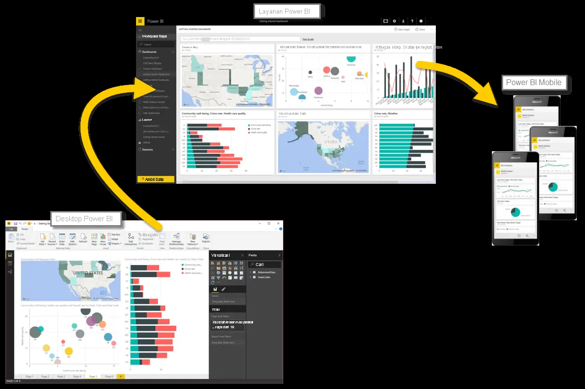

Sekarang setelah kami memperkenalkan dasar-dasar Microsoft Power BI, mari kita terjun ke pengalaman langsung dan mengikuti tur panduan. 

Aktivitas dan analisis yang akan Anda pelajari menggunakan Power BI biasanya mengikuti alur umum. **Alur umum** aktivitas terjadi seperti ini:

1. Memasukkan data ke Power BI Desktop dan membuat laporan.
2. Menerbitkan laporan ke layanan Power BI, tempat Anda dapat membuat visualisasi baru atau menyusun dasbor.
3. Membagikan dasbor dengan orang lain, terutama orang-orang yang sedang bepergian.
4. Menampilkan dan berinteraksi dengan dasbor dan laporan bersama di aplikasi Power BI Mobile.

Seperti yang telah disebutkan sebelumnya, Anda mungkin menghabiskan seluruh waktu Anda di **layanan Power BI**, melihat visual dan laporan yang telah dibuat oleh orang lain. Hal ini bukanlah sebuah masalah. Orang lain di tim Anda mungkin menghabiskan waktu mereka di **Power BI Desktop**, yang juga bukan merupakan sebuah masalah. Untuk membantu Anda memahami kontinum penuh Power BI dan apa yang dapat dilakukannya, kami akan menunjukkan semuanya kepada Anda. Kemudian, Anda dapat memutuskan cara menggunakan Power BI untuk keuntungan terbaik Anda.

Jadi, mari segera mempelajarinya. Urutan pertama bisnis Anda adalah mempelajari blok penyusun dasar Power BI, yang akan memberikan dasar kuat untuk mengubah data menjadi laporan dan visual yang keren.

