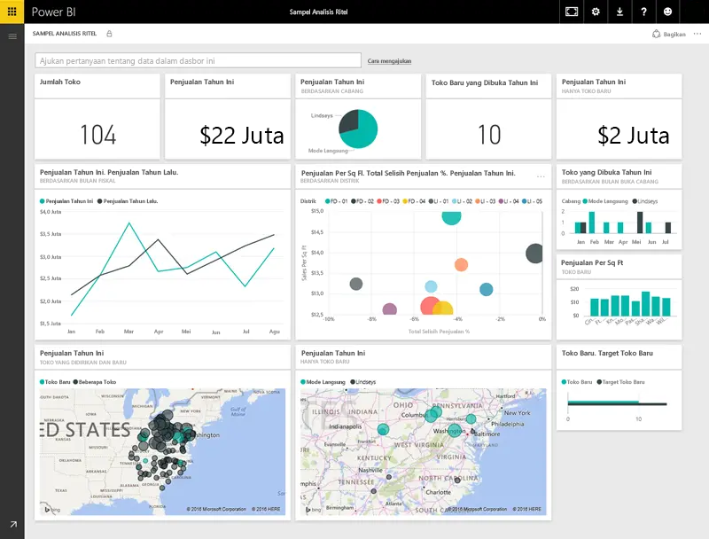
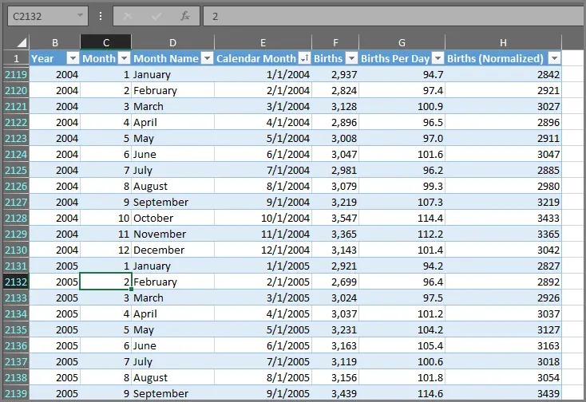
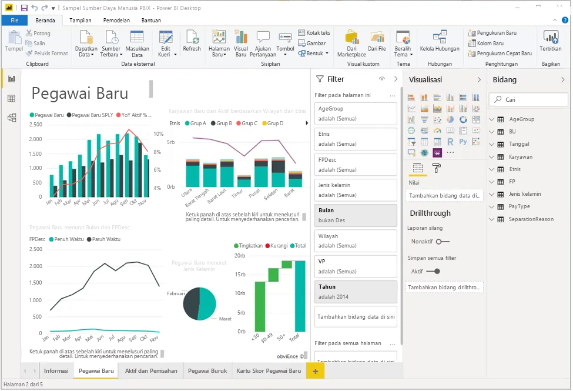
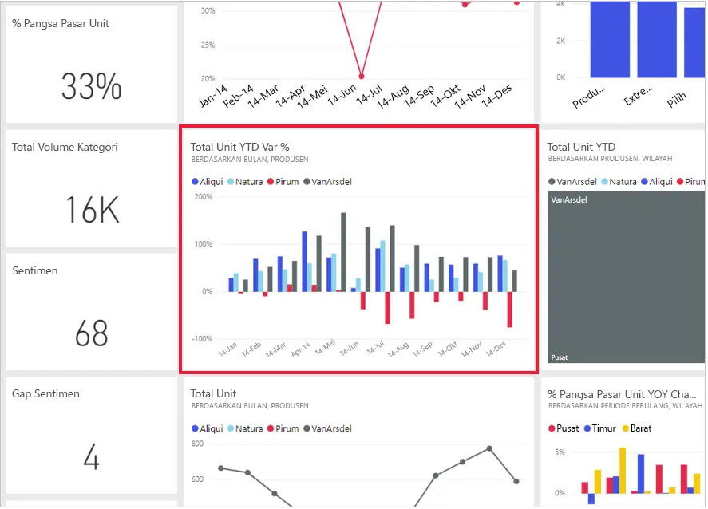

Semua yang Anda lakukan di Microsoft Power BI dapat dipecah menjadi beberapa **blok penyusun** dasar. Setelah Anda memahami blok penyusun ini, Anda dapat mendalami masing-masing blok penyusun serta mulai membuat laporan yang rumit dan kompleks. Lagi pula, bahkan hal yang tampaknya kompleks dibangun dari blok penyusun dasar. Misalnya, bangunan dibuat menggunakan kayu, baja, beton, dan kaca; lalu mobil terbuat dari logam, kain, dan karet. Tentu saja bangunan dan mobil juga dapat dibuat secara sederhana ataupun rumit, bergantung pada bagaimana blok penyusun dasar tersebut diatur.

Mari mempelajari blok penyusun dasar ini, mendiskusikan beberapa hal sederhana yang dapat dibuat menggunakan blok tersebut, dan kemudian melihat sekilas hal kompleks yang juga dapat dibuat menggunakan blok tersebut.

Berikut adalah blok penyusun dasar di Power BI:

* Visualisasi
* Himpunan Data
* Laporan
* Dasbor
* Petak peta

## Visualisasi

**Visualisasi** (terkadang juga disebut sebagai **visual**) adalah representasi visual data, seperti bagan, peta berkode warna, atau hal menarik lainnya yang dapat dibuat untuk mewakili data Anda secara visual. Power BI memiliki semua jenis tipe visualisasi dan akan bertambah seiring waktu. Gambar berikut ini menampilkan kumpulan visualisasi yang dibuat di Power BI.

Visualisasi dapat terlihat sederhana, seperti satu angka yang mewakili sesuatu yang signifikan, atau dapat merupakan visual kompleks, seperti peta berwarna gradien yang menunjukkan sentimen pemilih tentang kekhawatiran atau masalah sosial tertentu. Tujuan dari visual adalah menyajikan data dengan memberikan konteks dan wawasan, yang keduanya mungkin akan sulit dilihat dari tabel mentah berisi angka atau teks.

## Himpunan Data

**Himpunan data** adalah kumpulan data yang digunakan Power BI untuk membuat visualisasi.

Anda dapat membuat kumpulan data sederhana yang didasarkan pada satu tabel dari buku kerja Microsoft Excel, mirip dengan apa yang ditampilkan dalam gambar berikut ini.

**Himpunan data** juga dapat berupa kombinasi dari banyak sumber berbeda, yang bisa Anda filter dan gabungkan agar membentuk kumpulan data unik (himpunan data) untuk digunakan di Power BI.

Misalnya, Anda dapat membuat himpunan data dari tiga bidang database, satu tabel situs web, satu tabel Microsoft Excel, dan hasil online kampanye pemasaran email. Kombinasi unik tersebut masih dianggap sebagai satu **himpunan data**, meskipun disusun dari banyak sumber yang berbeda.

Memfilter data sebelum memasukkannya ke Power BI memungkinkan Anda fokus pada data yang penting bagi Anda. Misalnya, Anda dapat memfilter database kontak sehingga hanya pelanggan yang menerima email dari kampanye pemasaran yang disertakan dalam himpunan data. Anda kemudian dapat membuat visual berdasarkan subset pelanggan (koleksi yang difilter) yang disertakan dalam kampanye tersebut. Pemfilteran membantu Anda memfokuskan data dan upaya Anda.

Bagian penting dan yang memungkinkan dari Power BI adalah banyaknya **konektor** data yang disertakan. Baik data yang Anda inginkan ada di Excel atau database Microsoft SQL Server, di Azure atau Oracle, di layanan seperti Facebook, Salesforce, atau MailChimp, Power BI memiliki konektor data bawaan yang memungkinkan Anda terhubung dengan mudah ke data tersebut, memfilternya jika perlu, dan memasukkannya ke dalam himpunan data Anda.

Setelah Anda memiliki himpunan data, Anda dapat mulai membuat visualisasi yang menunjukkan bagian berbeda data tersebut dengan cara yang berbeda, dan mendapatkan wawasan berdasarkan apa yang Anda lihat. Dari situlah laporan dibuat.

## Laporan

Di Power BI, **laporan** adalah kumpulan visualisasi yang ditampilkan bersama-sama pada satu atau beberapa halaman. Sama seperti laporan lain yang mungkin Anda buat untuk presentasi penjualan atau tulis untuk tugas sekolah, laporan di Power BI adalah kumpulan item yang terkait satu sama lain. Gambar berikut ini menunjukkan **laporan** di Power BI Desktop. Dalam contoh ini, gambar tersebut adalah halaman kedua dari laporan berisi lima halaman. Anda juga dapat membuat laporan di layanan Power BI.

Laporan memungkinkan Anda membuat banyak visualisasi (di beberapa halaman jika perlu) dan menyusun visualisasi tersebut dengan cara yang terbaik untuk menceritakan kisah Anda.

Anda mungkin memiliki laporan tentang penjualan triwulanan, pertumbuhan produk di segmen tertentu, atau pola migrasi beruang kutub. Apa pun subjeknya, laporan memungkinkan Anda mengumpulkan dan mengatur visualisasi dalam satu halaman (atau lebih).

## Dasbor

Saat Anda siap untuk membagikan laporan atau kumpulan visualisasi, Anda dapat membuat **dasbor**. Sama seperti dasbor di mobil, **dasbor** Power BI adalah kumpulan visual dari satu halaman yang dapat Anda bagikan dengan orang lain. Sering kali, ini adalah sekelompok visual terpilih yang memberikan wawasan cepat tentang data atau cerita yang ingin Anda tampilkan.

Dasbor harus berukuran cukup kecil sehingga dapat dimuat di satu halaman yang sering disebut kanvas. Kanvas adalah latar belakang kosong di Power BI Desktop atau layanan tempat Anda menyusun visualisasi. Anggap saja seperti kanvas yang digunakan seorang seniman atau pelukis. Ini adalah ruang kerja tempat Anda membuat, menggabungkan, dan mengerjakan ulang visual yang menarik serta menginspirasi.
Anda dapat membagikan dasbor dengan pengguna atau grup lain, yang kemudian dapat berinteraksi dengan dasbor Anda saat mereka berada di layanan Power BI atau di perangkat seluler.

## Petak peta

Di Power BI, **petak peta** adalah visualisasi tunggal pada dasbor. Ini adalah kotak persegi panjang yang berisikan visual individu. Dalam gambar berikut, Anda akan melihat satu petak peta yang juga dikelilingi oleh petak peta lainnya.

Saat *membuat* dasbor di Power BI, Anda dapat memindahkan atau menyusun petak peta sesuai keinginan. Anda dapat membuatnya lebih besar, mengubah tinggi atau lebarnya, dan menyisipkannya ke petak peta lain.

Saat Anda *menampilkan*, atau *menggunakan*, dasbor atau laporan—yang berarti Anda bukan pembuat atau pemilik, tetapi laporan atau dasbor telah dibagikan kepada Anda—Anda dapat berinteraksi tetapi tidak dapat mengubah ukuran petak peta atau pengaturannya.

## Anda sudah mengetahui semua informasinya sekarang

Itulah dasar-dasar Power BI dan blok penyusunnya. Mari mempelajarinya kembali.

Power BI adalah kumpulan layanan, aplikasi, dan konektor yang memungkinkan Anda terhubung ke data di mana pun data tersebut berada, melakukan filter jika perlu, lalu memasukkannya ke Power BI untuk membuat visualisasi inspiratif yang dapat Anda bagikan dengan orang lain.

Kini setelah Anda mempelajari blok penyusun dasar Power BI, pastikan bahwa Anda dapat membuat himpunan data yang masuk akal *bagi Anda* dan membuat laporan yang menginspirasi secara visual serta mewakili cerita Anda. Cerita yang ditampilkan menggunakan Power BI tidak harus rumit untuk menjadi inspiratif.

Untuk beberapa orang, menggunakan satu tabel Excel dalam himpunan data lalu membagikan dasbor kepada tim mereka adalah cara yang sangat berguna dalam menggunakan Power BI.

Untuk beberapa orang lainnya, nilai Power BI ada pada penggunaan tabel Azure Synapse Analytics real-time yang digabungkan dengan sumber real-time dan database lainnya untuk membuat himpunan data momen demi momen.

Proses untuk kedua grup sama: membuat himpunan data, membuat visual yang menginspirasi, dan membagikannya kepada orang lain. Hasilnya juga sama untuk kedua grup: memanfaatkan data yang terus berkembang dan mengubahnya menjadi wawasan yang dapat ditindaklanjuti.

Baik wawasan data memerlukan himpunan data yang sederhana atau kompleks, Power BI membantu Anda memulai dengan cepat dan dapat diperluas sesuai kebutuhan sehingga mampu memenuhi kebutuhan kompleksitas data Anda. Karena Power BI adalah produk Microsoft, Anda dapat mengandalkan kekuatannya, ekstensibilitasnya, kompatibilitasnya dengan Microsoft Office, dan kesiapannya untuk perusahaan.

Sekarang mari lihat cara kerjanya. Kita akan mulai dengan melihat sekilas layanan Power BI.
