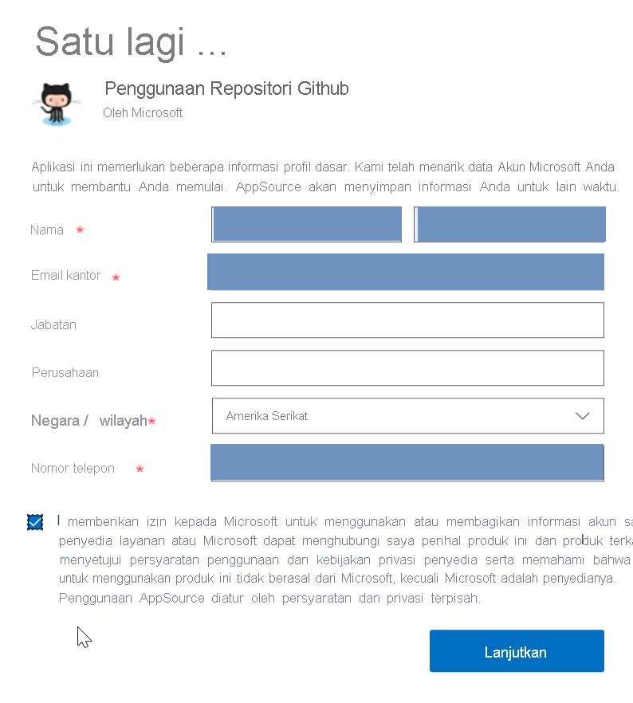
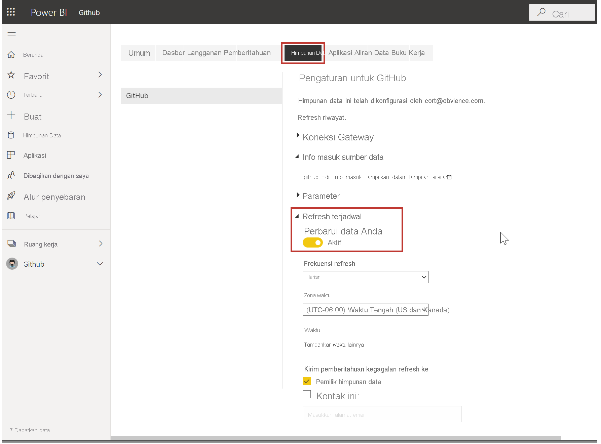

Seperti yang dipelajari di unit sebelumnya, alur kerja umum di Microsoft Power BI adalah membuat laporan di Power BI Desktop, menerbitkannya ke layanan Power BI, lalu membagikannya dengan orang lain sehingga mereka dapat melihatnya di layanan atau di aplikasi seluler.

Namun karena beberapa orang memulai di layanan Power BI, mari melihatnya terlebih dahulu dan mempelajari cara yang mudah dan populer untuk membuat visual dengan cepat di Power BI: *aplikasi*.

**Aplikasi** adalah kumpulan laporan dan visual siap pakai yang telah ditetapkan sebelumnya dan dibagikan kepada seluruh organisasi. Menggunakan aplikasi sama seperti menggunakan microwave untuk makanan beku atau saat memesan makanan siap saji: Anda hanya perlu menekan beberapa tombol atau membuat beberapa komentar, dan Anda akan dengan segera melihat koleksi data pembuka yang dirancang agar sesuai antara yang satu dengan yang lain, semua disajikan dalam paket rapi serta siap pakai.

Jadi, mari lihat sekilas tentang aplikasi, layanan, dan cara kerjanya. Kami akan menjelaskan lebih detail tentang aplikasi (dan layanan) dalam modul yang akan datang, tetapi Anda dapat menganggap ini sebagai upaya memenuhi rasa penasaran Anda. Anda dapat masuk ke layanan di <a href="https://powerbi.microsoft.com" target="_blank">https://powerbi.microsoft.com</a>. 

## Membuat dasbor unik dengan layanan cloud
Dengan Power BI, Anda dapat terhubung ke data dengan mudah. Dari layanan Power BI, Anda dapat memilih tombol **Dapatkan Data** di sudut kiri bawah halaman beranda.

*Kanvas* (area di tengah layanan Power BI) menunjukkan sumber data yang tersedia di layanan Power BI. Selain sumber data umum seperti file Microsoft Excel, database, atau data Microsoft Azure, Power BI dapat dengan mudah tersambung ke berbagai **layanan perangkat lunak** (juga disebut penyedia SaaS atau layanan cloud): Salesforce, Facebook, Google Analytics, dan banyak lagi.

Untuk layanan perangkat lunak ini, **layanan Power BI** menyediakan kumpulan visual siap pakai yang telah disusun sebelumnya di dasbor dan laporan untuk organisasi Anda. Koleksi visual ini disebut **aplikasi**. Aplikasi memungkinkan Anda memulai dengan cepat, menggunakan data dan dasbor yang telah disiapkan organisasi untuk Anda. Misalnya, saat menggunakan aplikasi GitHub, Power BI terhubung ke akun GitHub Anda (setelah Anda memberikan kredensial), kemudian mengisi kumpulan visual dan dasbor yang dibuat sistem di Power BI.

Ada beberapa aplikasi untuk semua jenis layanan online. Gambar berikut menunjukkan satu halaman daftar aplikasi yang tersedia untuk berbagai layanan online, dalam urutan alfabet. Halaman ini ditampilkan saat Anda memilih tombol **Dapatkan** di kotak **Layanan** (ditunjukkan pada gambar sebelumnya). Seperti yang Anda lihat dari gambar berikut, ada banyak aplikasi yang dapat dipilih.

Untuk tujuan kita, kita akan memilih **GitHub**. GitHub adalah aplikasi untuk mengontrol sumber online. Ketika Anda memilih tombol **Dapatkan sekarang** di kotak untuk aplikasi GitHub, kotak dialog **Sambungkan ke GitHub** muncul. Perhatikan bahwa GitHub tidak mendukung Internet Explorer, jadi pastikan Anda menggunakan browser lain.

Setelah Anda memasukkan informasi dan info masuk untuk aplikasi GitHub, penginstalan aplikasi dimulai.

Setelah data dimuat, dasbor aplikasi GitHub yang dibuat sistem akan muncul.

Selain **dasbor** aplikasi, **laporan** yang dihasilkan (sebagai bagian dari aplikasi GitHub) dan digunakan untuk membuat dasbor tersedia, seperti halnya **himpunan data** (kumpulan data yang diambil dari GitHub) yang dibuat selama impor data dan digunakan untuk membuat laporan GitHub.

Anda dapat memilih dan berinteraksi dengan visual mana pun. Jika Anda mengklik bagian dalam satu visual, semua visual lain di halaman akan memfilternya.  Misalnya, ketika Anda mengklik **MIHART** di bagan donat pada laporan Permintaan **Pull, visual** lain di halaman menyesuaikan untuk mencerminkan pilihan tersebut.

## Memperbarui data dalam layanan Power BI
Anda juga dapat memilih untuk **memperbarui** himpunan data untuk aplikasi, atau data lain yang Anda gunakan di Power BI. Untuk menetapkan pengaturan pembaruan, pilih ikon pembaruan jadwal untuk himpunan data yang ingin Anda perbarui, lalu gunakan menu yang muncul. Anda juga dapat memilih ikon pembaruan (lingkaran dengan panah) di samping ikon pembaruan jadwal untuk segera memperbarui himpunan data.

Tab **Himpunan Data** dipilih pada halaman **Pengaturan** yang muncul. Di panel sebelah kanan, pilih tanda panah di samping **Refresh terjadwal** untuk memperluas bagian tersebut. Kotak dialog **Pengaturan** muncul di kanvas, memungkinkan Anda mengatur pengaturan pembaruan sesuai kebutuhan.

Hal ini sudah cukup untuk melihat layanan Power BI secara sekilas. Ada banyak hal lain yang dapat Anda lakukan dengan layanan ini, kami akan membahasnya nanti dalam modul ini dan dalam modul yang akan datang. Perlu diingat, bahwa ada banyak jenis data yang dapat terhubung dengan Anda, begitu pula jenis aplikasi, dan keduanya akan bertambah seiring waktu.

