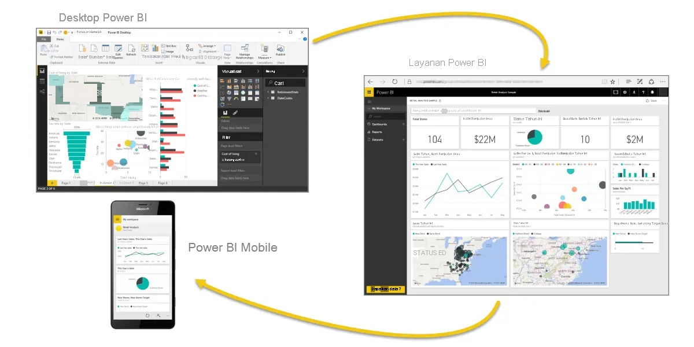

Mari kita lakukan tinjauan cepat tentang apa yang dibahas dalam modul ini.

**Microsoft Power BI** adalah kumpulan layanan perangkat lunak, aplikasi, dan konektor yang berfungsi bersama untuk mengubah data Anda menjadi wawasan yang interaktif. Anda dapat menggunakan data dari sumber dasar tunggal, seperti buku kerja Microsoft Excel, atau mengambil data dari beberapa database dan sumber cloud untuk membuat laporan dan himpunan data yang kompleks. Power BI dapat terlihat sesederhana yang Anda inginkan atau siap untuk perusahaan agar dapat memenuhi kompleksitas data yang dibutukan bisnis global Anda.

Power BI terdiri dari tiga elemen utama—**Power BI Desktop**, **layanan Power BI**, dan **Power BI Mobile**—yang bekerja sama untuk memungkinkan Anda membuat, berinteraksi, berbagi, dan menggunakan data Anda sesuai yang Anda inginkan.

Kita juga membahas blok penyusun dasar di Power BI:

* **Visualisasi** – Representasi visual data, terkadang juga disebut visual
* **Himpunan Data** – Kumpulan data yang digunakan Power BI untuk membuat visualisasi
* **Laporan** – Kumpulan visual dari himpunan data, mencakup satu halaman atau lebih
* **Dasbor** – Koleksi visual dalam satu halaman yang dibuat dari laporan
* **Petak Peta** – Visualisasi tunggal pada laporan atau dasbor

Di **layanan Power BI**, kami menginstal **aplikasi** hanya dengan beberapa klik. **Aplikasi** yang berisi koleksi visual dan laporan siap pakai itu, memungkinkan kita terhubung dengan mudah ke **layanan perangkat lunak** untuk mengisi aplikasi dan membuat data tersebut lebih menarik.

Terakhir, kami menyiapkan **jadwal refresh** untuk data kami, sehingga kami tahu bahwa data sudah paling baru saat kembali ke layanan Power BI.

## Langkah berikutnya
**Selamat!** Anda telah menyelesaikan modul pertama **jalur pembelajaran** untuk Power BI. Anda sekarang memiliki dasar pengetahuan yang kuat untuk beralih ke modul berikutnya, yang mempelajari langkah untuk membuat laporan pertama Anda. 

Kami telah menyebutkan hal ini sebelumnya, tetapi perlu kami ulangi: jalur pembelajaran ini membentuk pengetahuan Anda dengan mengikuti alur kerja umum di Power BI:

* Memasukkan data ke **Power BI Desktop** dan membuat laporan.
* **Menerbitkan** laporan ke layanan Power BI, tempat Anda membuat visualisasi baru atau menyusun dasbor.
* **Membagikan** dasbor kepada orang lain, terutama orang-orang yang sedang bepergian.
* Menampilkan dan berinteraksi dengan dasbor dan laporan bersama di aplikasi **Power BI Mobile**.

Anda mungkin tidak melakukan semua pekerjaan itu sendiri—beberapa orang hanya akan melihat dasbor yang dibuat oleh orang lain, dan mereka akan menggunakan layanan ini begitu saja. Hal ini bukan merupakan sebuah masalah, dan kami akan segera memiliki modul yang didedikasikan untuk menunjukkan cara Anda mengarahkan dan menggunakan **layanan Power BI** untuk menampilkan serta berinteraksi dengan laporan dan aplikasi dengan mudah.

Namun modul berikutnya mengikuti alur kerja di Power BI, menunjukkan kepada Anda cara membuat laporan dan menerbitkannya ke layanan Power BI. Anda akan mempelajari cara laporan dan dasbor tersebut dibuat dan tersambung ke data. Anda mungkin bahkan memutuskan untuk membuat laporan atau dasbor Anda sendiri.

Sampai jumpa di modul berikutnya!

